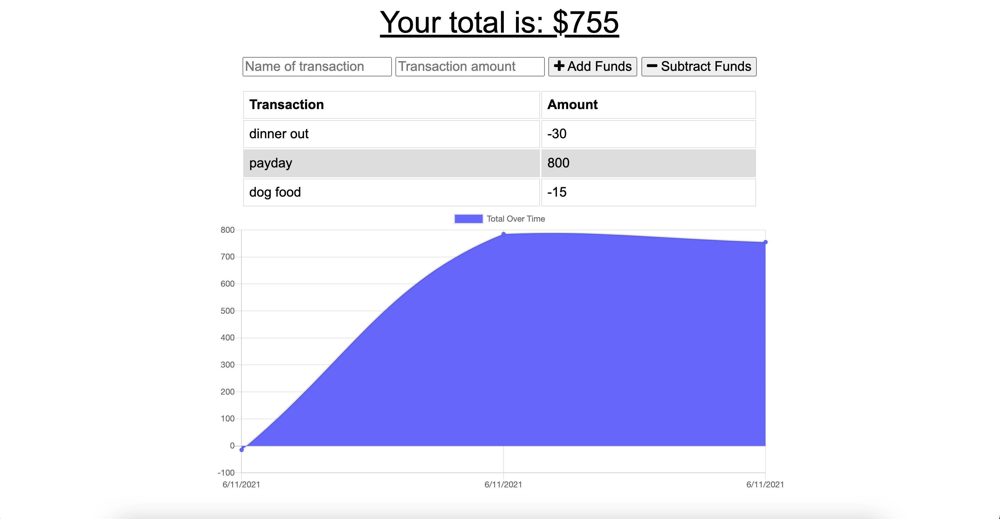

# Online/Offline Budget Tracker
This application is a budget Tracker application that allows for both online and offline access and functionality. Giving users a fast and easy way to track their money is important, but allowing them to access that information anytime is even more important. Having offline functionality is paramount to our applications success.

## Installation

### To download code base:
- go to https://github.com/lizaferguson/PWA-Online-Offline-Budget-Tracker
- clone code base onto local machine 
- run following commands to install node packages and initialize the server

```bash
npm i 
```

```bash
npm start
```
- navigate to localhost:[PORT] to view application

### To access deployed app on Heroku
- go to 
- 

## Usage

The user will be able to add expenses and deposits to their budget with or without a connection. When entering transactions offline, they should populate the total when brought back online.

Offline Functionality:

Enter deposits offline

Enter expenses offline

When brought back online:

Offline entries should be added to tracker.

### Below is an example image of the apps appearance:




## Contributing
Original code provided by Trilogy Education Services